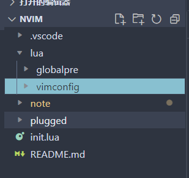

## 使用lua语言做基本的配置和开发

### 简介：

    首先lua语言是nvim中的一等公民，在nvim配置文件init.vim/init.lua 的根源目录下有一个lua的文件夹，
里面放置lua语言的代码就会被自动加载。

    这里只会记录一些简单的，详细请见链接：

[glepnir/nvim-lua-guide-zh: https://github.com/nanotee/nvim-lua-guide chinese version](https://github.com/glepnir/nvim-lua-guide-zh)

    目录结构如下：



### 运行时文件：

和 Vimscript 文件很像，位于 `runtimepath` 中的一些特殊目录中的 Lua 文件可以被 Neovim 自动加载。目前有以下这些特殊目录：

* `colors/`
* `compiler/`
* `ftplugin/`
* `indent/`
* `plugin/`
* `syntax/`

注意：在同一个运行时目录中，`*.vim` 文件会先于所有的 `*.lua` 文件被加载。

更多信息请参见：

* [`:help 'runtimepath'`](https://neovim.io/doc/user/options.html#'runtimepath')
* [`:help load-plugins`](https://neovim.io/doc/user/starting.html#load-plugins)

`提示:`因为运行时文件并不基于 Lua 模块系统，所以两个不同的插件都拥有 `plugins/main.lua` 文件是没有任何问题的。

### 在VimScript中使用lua语言：

语法： `:lua`

比如我想输出一个hello Word 只需要

```lua
lua print("hello Word"..."你好世界！！")
```

可以使用下面的格式编写多行的lua语言脚本,在lua后面加上<<EOF EOF

```lua
echo "Here's a bigger chunk of Lua code"

lua << EOF
local mod = require('mymodule')
local tbl = {1, 2, 3}

for k, v in ipairs(tbl) do
    mod.method(v)
end

print(tbl)
EOF
```


在vimScript里面直接调用lua语言的函数

如果函数是全局的，是可以直接调用的，比如：

```lua
lua 函数名()
```


### 导入lua语言文件：

可以使用刚才提到过的

```lua
lua require("lua语言模块名称")
```

使用特质的vimscript命令

```lua
:luafile ~/foo/bar/baz/myluafile.lua " 加载 myluafile.lua
:luafile %                           " 加载当前正在处理的文件
:source ~/foo/bar/baz/myluafile.lua
:source %
```

### lua语言中保留的VimScriptApi:

#### API

Neovim 会暴露一个全局的 `vim` 变量来作为 Lua 调用 Vim 的 APIs 的入口。它还提供给用户一些额外的函数和子模块“标准库”

一些比较实用的函数和子模块如下：

* `vim.inspect`: 把 Lua 对象以更易读的方式打印（在打印 Lua table 时会很有用）
* `vim.regex`: 在 Lua 中使用 Vim 正则表达式
* `vim.api`: 暴露 vim 的 API(`:h API`) 的模块（别的远程调用也是调用同样的 API)
* `vim.ui`: 可被插件覆写的 UI 相关函数
* `vim.loop`: Neovim 的 event lopp 模块（使用 LibUV)
* `vim.lsp`: 控制内置 LSP 客户端的模块
* `vim.treesitter`: 暴露 tree-sitter 库中一些实用函数的模块

上面列举功能的并不全面。如果你想知道更多可行的操作可以参见：[`:help lua-stdlib`](https://neovim.io/doc/user/lua.html#lua-stdlib) 和 [`:help lua-vim`](https://neovim.io/doc/user/lua.html#lua-vim)。你也可以通过 `:lua print(vim.inspect(vim))` 获得所有可用模块。API 函数的详细文档请参见 [`:help api-global`](https://neovim.io/doc/user/api.html#api-global)

#### Tips

每次你想检查一个对象时到要用 `print(vim.inspect(x))` 是相当繁琐的。你可以你的配置中写一个全局的包装器函数来替代这个繁琐的过程（在 Neovim 0.7.0+ 中，你可以使用内建的 `vim.pretty_print()` ，请参见 [`:help vim.pretty_print()`](https://neovim.io/doc/user/lua.html#vim.pretty_print())）

```lua
function _G.put(...)
    local objects = {}
    for i = 1, select('#', ...) do
        local v = select(i, ...)
        table.insert(objects, vim.inspect(v))
     end

     print(table.concat(objects, '\n'))
     return ...
end
```

之后你就可以使用如下命令来快速检查对象内容了

```lua
put({1, 2, 3})
```

```viml
:lua put(vim.loop)
```

此外，你也可以使用 `:lua` 命令通过在 Lua 表达式前加上 `=` 来美观地打印它

```viml
:lua =vim.loop
```

另外要注意的是，你可能会发现 Lua 会比其他语言少一些实用的内置函数（例如：`os.clock()`，返回以秒为单位，而不是以毫秒为单位的值）。仔细阅读 Neovim 提供的标准库和 `vim.fn` （后续还会有更多内容），里面可以会有你想要的东西。

### 在lua语言中直接执行VimScript：

#### 使用vim.cmd

vim.api.nvim_exec()` 的别名。只需要命令部分的参数，`output `参数始终为`false

```lua
vim.cmd('source' .. BasePath .. 'lua/vimconfig/pluged/symbolauto.vim')

-- 你可以使用多行文本块
vim.cmd([[
....内容
]])
```

#### vim.api.nvim_exec()

此函数用于计算 Vimscript 代码块。它接受一个包含要执行的源代码的字符串和一个布尔值，以确定代码的输出是否应该由函数返回（例如，您可以将输出存储在变量中）。

```lua
local result = vim.api.nvim_exec(
[[
let mytext = 'hello world'

function! MyFunction(text)
    echo a:text
endfunction

call MyFunction(mytext)
]],
true)

print(result) -- 'hello world'
```
